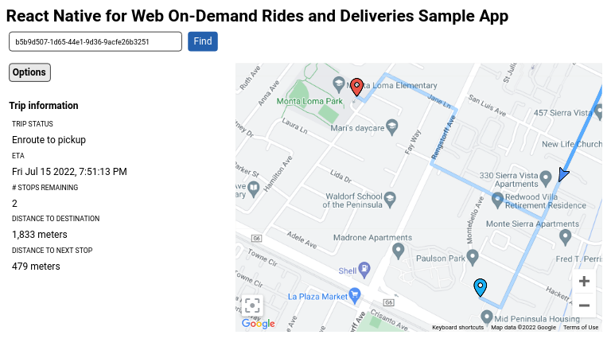

# React Native for Web On-Demand Rides and Deliveries Sample

## Architecture

In order to run the full end-to-end **journey sharing** use case, you need 4
components:

- a [provider backend](https://github.com/googlemaps/java-on-demand-rides-deliveries-stub-provider)
  as it can be utilized by Android, iOS, and JavaScript client samples.
- a driver app ([Android](https://github.com/googlemaps/android-on-demand-rides-deliveries-samples/) | [iOS](https://github.com/googlemaps/ios-on-demand-rides-deliveries-samples/))
- a consumer app ([Android](https://github.com/googlemaps/android-on-demand-rides-deliveries-samples/) | [iOS](https://github.com/googlemaps/ios-on-demand-rides-deliveries-samples/))
- a web app (included in this repository)

The consumer and driver mobile apps communicate with the provider backend. The web app also communicates with the provider backend to request authentication tokens. The provider backend communicates with the Fleet Engine.

## Prerequisites

1. Complete [Getting Started with Fleet Engine](https://developers.google.com/maps/documentation/transportation-logistics/on-demand-rides-deliveries-solution/trip-order-progress/fleet-engine).
2. Run [provider backend](https://github.com/googlemaps/java-on-demand-rides-deliveries-stub-provider).
3. Run both consumer mobile app and the driver mobile app. Use these to create vehicles and trips to track with the React Native Web sample app.

## Getting started

### Step 1 - Download and install dependencies

These dependencies are needed to run the sample app. If you have them installed already you can skip these steps below.

- Download & install node from https://nodejs.org/en/download/
- Download & install expo CLI:

```
npm install --global expo-cli
```

### Step 2 - Populate `./node_modules`

This will install all packages declared in `package.json` of the sample project to make sure all dependencies are properly installed.

```
npm install --legacy-peer-deps
```

### Step 3 - Add API key and other metadata (required)

In `/src/utils/consts.tsx`, do the following:

- Set the `PROVIDER_URL` constant to the URL of your provider that was set up in Prerequisite #2.
- Set the `PROVIDER_PROJECT_ID` constant to your Cloud project ID
- Set the `API_KEY` constant to your Google Maps API key

```typescript
// Replace 'YOUR_PROVIDER_URL' with the URL of your provider. See
// https://github.com/googlemaps/java-on-demand-rides-deliveries-stub-provider
// for instructions on how to set up a provider.
export const PROVIDER_URL = 'YOUR_PROVIDER_URL';
export const PROVIDER_PROJECT_ID = 'YOUR_PROJECT_ID';
export const API_KEY = 'YOUR_API_KEY';
```

### Step 4 - Run the sample app

From this directory, run `npm run web` to start a development server. The app will automatically reload if you change any of the source files.

### Step 5 - Start tracking a trip

Enter a trip ID for a trip you created (Prerequisite #3) in the Trip ID input field and click "Find".



## Important references

- [Installing Cloud SDK](https://cloud.google.com/sdk/docs/install)
- [Transportation SDKs - JavaScript SDK Setup](https://developers.google.com/maps/documentation/transportation-logistics/on-demand-rides-deliveries-solution/trip-order-progress/consumer-sdk/consumer_sdk_quickstart_javascript)
